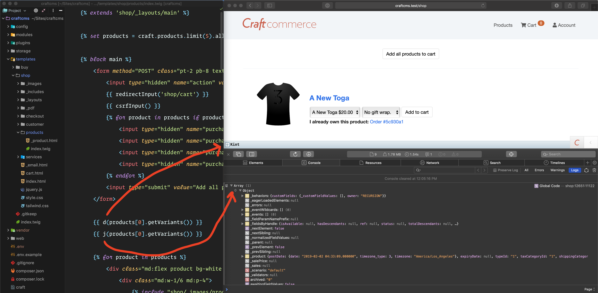

# Kint plugin for Craft CMS
Adds Kint, an in-app PHP debugger for use in Twig and PHP.

## Installation
You can install Kint via the plugin store, or through Composer.

### Craft Plugin Store
To install **Kint**, navigate to the _Plugin Store_ section of your Craft control panel, search for `Kint`, and click the _Try_ button.

### Composer
You can also add the package to your project using Composer.

1. Open your terminal and go to your Craft project:

        cd /path/to/project

2. Then tell Composer to load the plugin:
    
        composer require verbb/kint

3. In the Control Panel, go to Settings → Plugins and click the “Install” button for Kint.

## Kint Overview
Kint is an interactive debugger for PHP applications. Full documentation is available at https://github.com/kint-php/kint/.

Its advantages include that it can be run out of devMode (though you would not want to use it in a public setting), and
it is interactive, with keyboard shortcuts to expand and collapse objects, separates content from methods, etc.

## Using Kint
- Click anywhere on the bar to unfold it
- Double click + to unfold all children
- Press d to toggle keyboard navigation.
- Press the “⇄” icon on the right to see what code you’d need to use to get at a piece of data.
- Press the “⌕” icon on the right to open a live search.
- Change tabs to see different views of data.
- You can sort tables of data by clicking on the headers.

### Templating

#### d (dump)
`{{ d(entry) }}` or `{{ d(entry, otherEntry) }}`

This is the simplest usage, and will output an interactive debugger for the variable passed in.

#### j (dump - console.log())
`{{ j(entry) }}` or `{{ j(entry, otherEntry) }}`

This is the same as `d`, except all output will be sent to `console.log()`

#### s (simple dump)
`{{ s(someTwigVariable) }}` or `{{ s(entry, otherEntry) }}`

This works essentially the same way as the built-in Twig dump method, and returns a plain text debugging output.

#### microtime (point-in-time memory usage and timestamp)
`{{ microtime() }}` and `{{ microtime(true) }}` to reset the counter

Basic reporting of memory usage at the time that the command is run, as well as a timestamp. If used multiple times,
it will also report the time since it was last called and average duration. Passing `true` as an argument will reset the counter.

#### trace (backtrace)
`{{ trace() }}`

Outputs a PHP backtrace from the point at which the function is called - note, this function uses quite a bit of memory
(you should likely set `memory_limit 512M`, and the output might not be all that helpful, as you are mostly going to be
seeing compiled PHP from the Twig templates.

## Credits
Originally created by the team at [Mildly Geeky, Inc.](https://mildlygeeky.com). Thank you to Jonathan Vollebregt and Rokas Šleinius, the developers behind [Kint](https://github.com/kint-php/kint/).

## Show your Support
Kint is licensed under the MIT license, meaning it will always be free and open source – we love free stuff! If you'd like to show your support to the plugin regardless, [Sponsor](https://github.com/sponsors/verbb) development.

<h2></h2>

