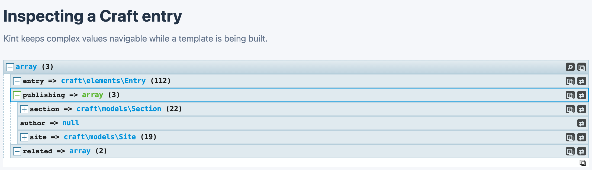

<!-- feature-intro -->
Kint brings an interactive PHP debugger to Craft development. Inspect variables from Twig or PHP with readable structure, useful type information, and less guesswork than a raw dump.
<!-- feature-intro-end -->

<!-- feature-section media-size="large" -->
## Better than a raw dump

Craft objects get complicated quickly, and a wall of raw output rarely makes them clearer. Send a variable to Kint and explore its arrays, properties and types through collapsible, structured output that keeps the useful detail within reach.

<!-- feature-section-end -->

<!-- feature-section -->
## Debug where you work

Inspect values in Twig where the front end is assembled or call the underlying library from modules, plugins and project PHP. Configuration controls the depth and presentation — and, importantly, keeps debugging output disabled where it should never appear.
<!-- feature-section-end -->
